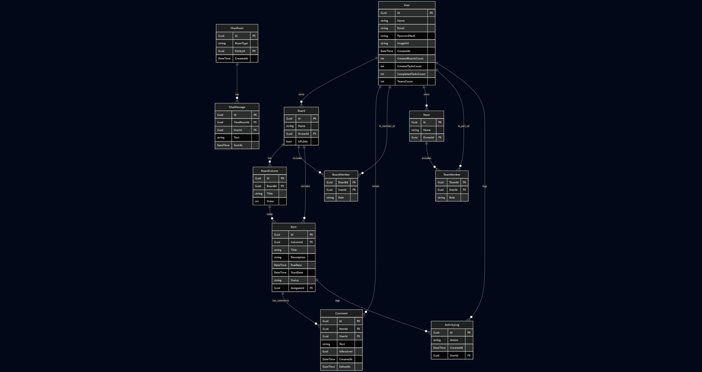

# 🧠 Simpled – Gestión colaborativa de ideas y tareas

> 🚀 _Clon inspirado en Trello / Notion con funcionalidades de organización en tiempo real y control de acceso por roles._

[](https://dotnet.microsoft.com/)  
[](https://nextjs.org/)  
[](https://react.dev/)  
[](https://www.typescriptlang.org/)  
[](https://sqlite.org/)  
[](https://learn.microsoft.com/en-us/aspnet/core/signalr/introduction)

---

## 📄 Índice

- [🧠 Simpled – Gestión colaborativa de ideas y tareas](#-simpled--gestión-colaborativa-de-ideas-y-tareas)
  - [📄 Índice](#-índice)
  - [🔧 Cómo clonar y ejecutar](#-cómo-clonar-y-ejecutar)
    - [▶ Backend (.NET 8)](#-backend-net-8)
    - [▶ Frontend (Next.js / React)](#-frontend-nextjs--react)
  - [🏛️ Arquitectura y tecnologías](#️-arquitectura-y-tecnologías)
    - [🧱 Backend (C# / .NET 8)](#-backend-c--net-8)
    - [🎨 Frontend (Next.js / React)](#-frontend-nextjs--react-1)
    - [🛠️ DevOps / Infraestructura](#️-devops--infraestructura)
  - [📁 Estructura del proyecto](#-estructura-del-proyecto)
  - [🌐 Endpoints principales](#-endpoints-principales)
    - [🔐 Autenticación](#-autenticación)
    - [👥 Usuarios](#-usuarios)
    - [🧩 Boards](#-boards)
    - [📦 Columnas](#-columnas)
    - [🗂 Items](#-items)
  - [🗃️ Base de datos y E/R](#️-base-de-datos-y-er)
    - [Entidades Principales](#entidades-principales)
  - [🚀 Despliegue](#-despliegue)
    - [🔗 Enlaces de Producción](#-enlaces-de-producción)
  - [📚 Referencias y bitácora](#-referencias-y-bitácora)
    - [📘 Bibliografía](#-bibliografía)
    - [📒 Bitácora](#-bitácora)
  - [📺 Vídeos](#-vídeos)
  - [📌 Enlace al anteproyecto](#-enlace-al-anteproyecto)
  - [👥 Autores](#-autores)

---

## 🔧 Cómo clonar y ejecutar

```bash
git clone https://github.com/usuario/simpled.git
cd simpled
```

### ▶ Backend (.NET 8)

```bash
cd backend/Simpled
dotnet restore
dotnet run
```

> ⚠ Es obligatorio tener instalado el **.NET 8 SDK**.

### ▶ Frontend (Next.js / React)

```bash
cd frontend
npm install
npm run dev
```

> ⚠ Es obligatorio tener instalado **Node.js (LTS)**.

---

## 🏛️ Arquitectura y tecnologías

### 🧱 Backend (C# / .NET 8)

- **Framework y Core:**

  - ASP.NET Core Web API
  - Entity Framework Core
  - SQLite como base de datos
  - SignalR para comunicación en tiempo real

- **Seguridad:**
  - Autenticación con JWT
  - Autorización basada en roles
  - Validaciones con FluentValidation

### 🎨 Frontend (Next.js / React)

- **Core y Framework:**

  - Next.js 15.2.3
  - React 19.0.0
  - TypeScript 5.0
  - Tailwind CSS 4.0

- **UI/UX:**

  - Radix UI para componentes accesibles
  - Framer Motion para animaciones
  - Lucide React para iconografía
  - React Toastify para notificaciones

- **Gestión de Estado y Datos:**

  - Context API para estado global
  - React Query para fetching de datos
  - SignalR para tiempo real

- **Componentes Especializados:**

  - @dnd-kit para drag & drop
  - Recharts para visualización de datos
  - Pikaday para selección de fechas
  - React CountUp para animaciones numéricas

- **Herramientas de Desarrollo:**
  - ESLint con configuración personalizada
  - Prettier para formateo de código
  - TypeScript strict mode
  - Tailwind CSS con PostCSS

### 🛠️ DevOps / Infraestructura

- **Control de Versiones:**

  - Git con GitHub
  - GitHub Actions para CI/CD

- **Despliegue:**

  - Backend: Azure / AWS
  - Frontend: Vercel
  - Base de datos: SQLite en producción

- **Monitoreo y Logging:**
  - Application Insights
  - Serilog para logging estructurado

---

## 📁 Estructura del proyecto

```
Simpled/
├── backend/
│   └── Simpled/
│       ├── Controllers/
│       ├── Models/
│       ├── Dtos/
│       ├── Data/
│       ├── Hubs/
│       └── Program.cs
├── frontend/
│   ├── app/
│   ├── components/
│   │   ├── ui/
│   │   └── gantt-chart/
│   ├── contexts/
│   ├── lib/
│   ├── public/
│   └── types/
├── docs/
│   ├── presentacion.pdf
│   ├── Simpled_ER.png
│   └── Bitacora.md
└── README.md
```

---

## 🌐 Endpoints principales

### 🔐 Autenticación

- `POST /api/auth/login` → Login y obtención de token JWT
- `POST /api/auth/register` → Registro de nuevo usuario
- `POST /api/auth/refresh` → Renovación de token

### 👥 Usuarios

- `GET /api/users` → Listado de usuarios (admin)
- `GET /api/users/{id}` → Detalles de usuario
- `PUT /api/users/{id}` → Actualización de usuario
- `DELETE /api/users/{id}` → Eliminación de usuario

### 🧩 Boards

- `GET /api/boards` → Listar tableros
- `POST /api/boards` → Crear tablero
- `GET /api/boards/{id}` → Detalles de tablero
- `PUT /api/boards/{id}` → Actualizar tablero
- `DELETE /api/boards/{id}` → Eliminar tablero

### 📦 Columnas

- `GET /api/columns` → Listar columnas por board
- `POST /api/columns` → Crear columna
- `PUT /api/columns/{id}` → Actualizar columna
- `DELETE /api/columns/{id}` → Eliminar columna

### 🗂 Items

- `GET /api/items` → Listar tareas
- `POST /api/items` → Crear tarea
- `PUT /api/items/{id}` → Actualizar tarea
- `DELETE /api/items/{id}` → Eliminar tarea

---

## 🗃️ Base de datos y E/R



### Entidades Principales

- **Users**: Gestión de usuarios y autenticación
- **Boards**: Tableros de trabajo
- **Columns**: Columnas dentro de los tableros
- **Items**: Tareas y elementos
- **Dependencies**: Relaciones entre tareas
- **Attachments**: Archivos adjuntos
- **Comments**: Comentarios en tareas

---

## 🚀 Despliegue

### 🔗 Enlaces de Producción

- **Aplicación**: [simpled.app](https://simpled.app)

---

## 📚 Referencias y bitácora

### 📘 Bibliografía

- [Documentación oficial ASP.NET Core 8](https://learn.microsoft.com/aspnet/core)
- [Next.js Documentation](https://nextjs.org/docs)
- [React Documentation](https://react.dev/)
- [Tailwind CSS Documentation](https://tailwindcss.com/docs)
- [SignalR Documentation](https://learn.microsoft.com/en-us/aspnet/core/signalr/introduction)

### 📒 Bitácora

- Ver [bitacora.md](docs/bitacora.md) para el registro detallado de desarrollo.
- Ver [Documentacion_Front.md](docs/Documentacion_Front.md) para la documentación relacionada con el apartado front incluyendo Figma.

---

## 📺 Vídeos

- Video de presentación - [](https://youtu.be/7ciRupxl6A4)
- Video tutorial breve de funcionamiento -
- Video de entrega final -

---

## 📌 Enlace al anteproyecto

🔗 [📄 Ver anteproyecto en Notion](https://steady-rock-b8f.notion.site/AnteProyecto-Simpled-1bea38c3af458040a867de299d2016fb?pvs=74)

---

## 👥 Autores

- **Adrián Jiménez Santiago**
- **Elías Robles Ruiz**

> Proyecto Final de Grado del Ciclo Formativo de Desarrollo de Aplicaciones Web

---
